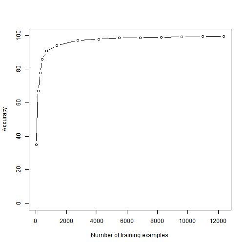

Human Activity Recognition using Random forest
========================================================
## summary

Human Activity Recognition - HAR - has emerged as a key research area in the last years and is gaining increasing attention by the pervasive computing research community, especially for the development of context-aware systems. There are many potential applications for HAR, like: elderly monitoring, life log systems for monitoring energy expenditure and for supporting weight-loss programs, and digital assistants for weight lifting exercises. 
In this report, our aim is to build classifier based on-body and ambient sensing features.  In order to extract previous features, six young health participants were asked to perform one set of 10 repetitions of the Unilateral Dumbbell Biceps Curl in five different fashions: exactly according to the specification (Class A), throwing the elbows to the front (Class B), lifting the dumbbell only halfway (Class C), lowering the dumbbell only halfway (Class D) and throwing the hips to the front (Class E). For evaluating our classifier performance,  we use several metrics and training dataset available at (https://d396qusza40orc.cloudfront.net/predmachlearn/pml-training.csv). Also, we apply our machine learning model to the 20 test cases available in the test data at (https://d396qusza40orc.cloudfront.net/predmachlearn/pml-testing.csv).

The report contain :
 1. Preprocessing Data.
 2. Cross validation evaluation.
 3. Building final model (70% training, 30% test).
 4. Treat 20 test cases.
 5. Influence of number of training examples to accuracy of model.
## Reading data


```r
library("caret")
```

```
## Loading required package: lattice
## Loading required package: ggplot2
```

```r
library("randomForest")
```

```
## randomForest 4.6-7
## Type rfNews() to see new features/changes/bug fixes.
```

```r
set.seed(1988)
data <- read.csv("./pml-training.csv")
```

## Preprocessing the data set
### Delet the first Column (user_name).

```r
data[,1]=NULL
```
### Impute Missing Values by median/mode (na.roughfix) and save vector of median mode.

```r
data1<-na.roughfix(data)
```
### Keep numeric features and delete  the other features.


```r
f<- function(x){
               if(class(x) == "numeric")
                  {T }
                else {F}
}

ind <- sapply(data1,f)
data1 <- data1[,ind]
data1 <- cbind(data1,classe=data$classe)
```

## Cross Validation for evaluation model accuracy

```r
folds <- createFolds(data1$classe,k=5)
Accuracy <- NULL

for(i in 1:length(folds)){
  
  trainingSet <- data1[folds[[i]],]
  testSet <- data1[-folds[[i]],]
  
  model <- randomForest(classe ~ .,data=trainingSet)
  
  predictClass <- predict(model,testSet)
  
  confMatrix <- confusionMatrix(data=predictClass,reference=testSet$classe)
  Accuracy <- c(Accuracy,confMatrix$overall["Accuracy"]*100)
}
```
The avearge Accuracy of crossvaliation with 5 groups is **96.8505**

## Create training and test sets w ith about 70% of the observations assigned to trainingSet and 30% to testSet.


```r
indexTraining <- createDataPartition(data1$classe,p=0.7,list=F)
trainingSet<- data1[indexTraining,]
testSet <- data1[-indexTraining,]
```

## Build machine learning final model using Random forest algorithme. 


```r
workMoedl <- randomForest(classe ~ .,data=trainingSet)
```

## Evaluation of predictive power of model using other test set (testSet)

```r
predictClass <- predict(workMoedl,testSet)
confMatrix <- confusionMatrix(data=predictClass,reference=testSet$classe)
confMatrix
```

```
## Confusion Matrix and Statistics
## 
##           Reference
## Prediction    A    B    C    D    E
##          A 1672   10    0    0    0
##          B    2 1120    5    0    0
##          C    0    9 1012   16    2
##          D    0    0    9  948    4
##          E    0    0    0    0 1076
## 
## Overall Statistics
##                                         
##                Accuracy : 0.99          
##                  95% CI : (0.987, 0.993)
##     No Information Rate : 0.284         
##     P-Value [Acc > NIR] : <2e-16        
##                                         
##                   Kappa : 0.988         
##  Mcnemar's Test P-Value : NA            
## 
## Statistics by Class:
## 
##                      Class: A Class: B Class: C Class: D Class: E
## Sensitivity             0.999    0.983    0.986    0.983    0.994
## Specificity             0.998    0.999    0.994    0.997    1.000
## Pos Pred Value          0.994    0.994    0.974    0.986    1.000
## Neg Pred Value          1.000    0.996    0.997    0.997    0.999
## Prevalence              0.284    0.194    0.174    0.164    0.184
## Detection Rate          0.284    0.190    0.172    0.161    0.183
## Detection Prevalence    0.286    0.192    0.177    0.163    0.183
## Balanced Accuracy       0.998    0.991    0.990    0.990    0.997
```

## Treat the test cases
 1. read test cases

```r
testCases <- read.csv("./pml-testing.csv")
```
 2. Delet the first Column (user_name) and last one (problem_id) and keep features of training 

```r
testCases[,1]=NULL
testCases[,ncol(testCases)]<-NULL
##ind are indexes of features used in training
testCases <- testCases[,ind]
```
 3. Impute Missing Values by median/mode of training set.

```r
for(i in 1:nrow(testCases)){
  for(j in 1:ncol(testCases)){
    if(is.na(testCases[i,j])){
      testCases[i,j]<- median(data1[,j])
    }
  }
}
```
 4. Predict classes of test cases

```r
answers <- predict(workMoedl,testCases)
```
 5. Write vector of ansxer in files (each answer in file)

```r
pml_write_files = function(x){
  n = length(x)
  for(i in 1:n){
    filename = paste0("problem_id_",i,".txt")
    write.table(x[i],file=filename,quote=FALSE,row.names=FALSE,col.names=FALSE)
  }
}

pml_write_files(answers)
```

## influence of number of training examples

```r
trainEvaluate <- function(rate){
  indexTraining <- createDataPartition(data1$classe,p=rate,list=F)
  trainingSet<- data1[indexTraining,]
  testSet <- data1[-indexTraining,]
  
  model <- randomForest(classe ~ .,data=trainingSet)
  
  predictClass <- predict(model,testSet)
  confMatrix <- confusionMatrix(data=predictClass,reference=testSet$classe)
  confMatrix$overall["Accuracy"]*100
}
rates <- c(0.001,0.01,0.02,0.03,0.05,0.1,0.2,0.3,0.4,0.5,0.6,0.7,0.8,0.9)
Accuracy <- NULL
n <- NULL
for(r in rates){
  n <- c(n,round(nrow(trainingSet)*r))
  Accuracy <- c(Accuracy,trainEvaluate(r))
}
plot(x=n,y=Accuracy,xlab="Number of training examples",ylab="Accuracy",type="b",ylim=c(0,100))  
```

 

